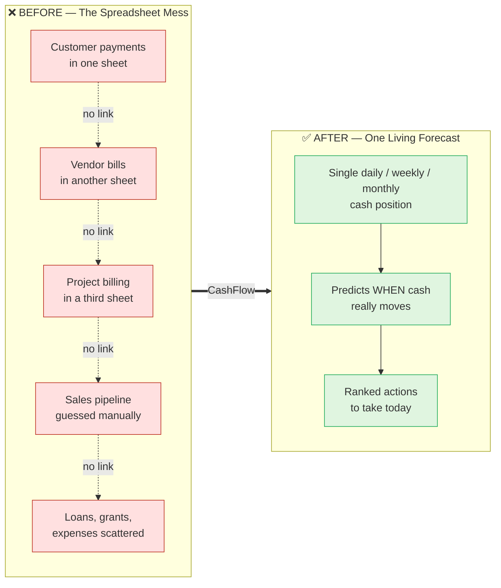
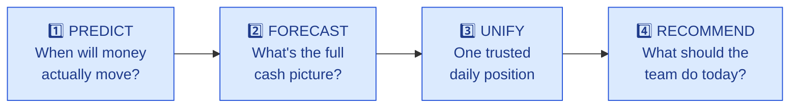
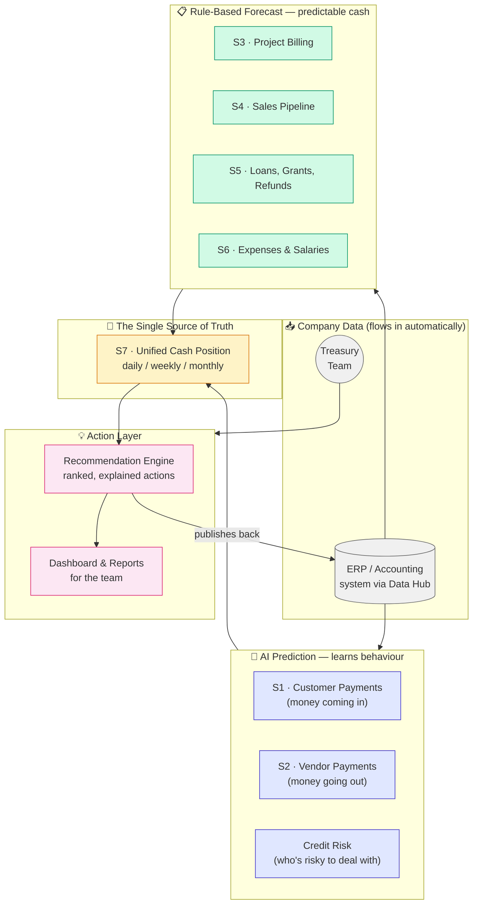
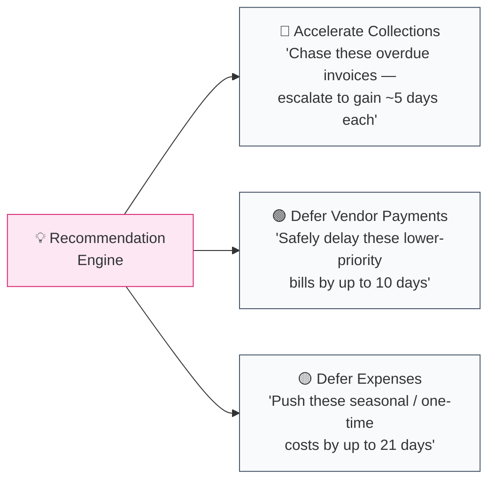
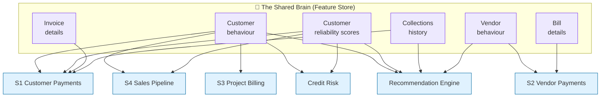
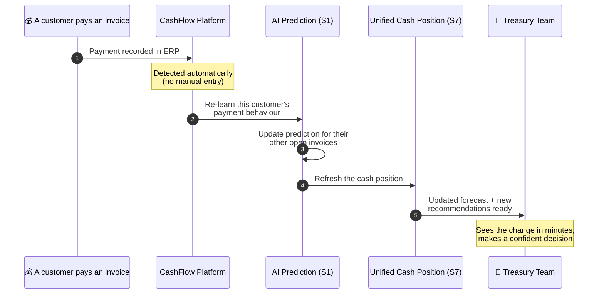
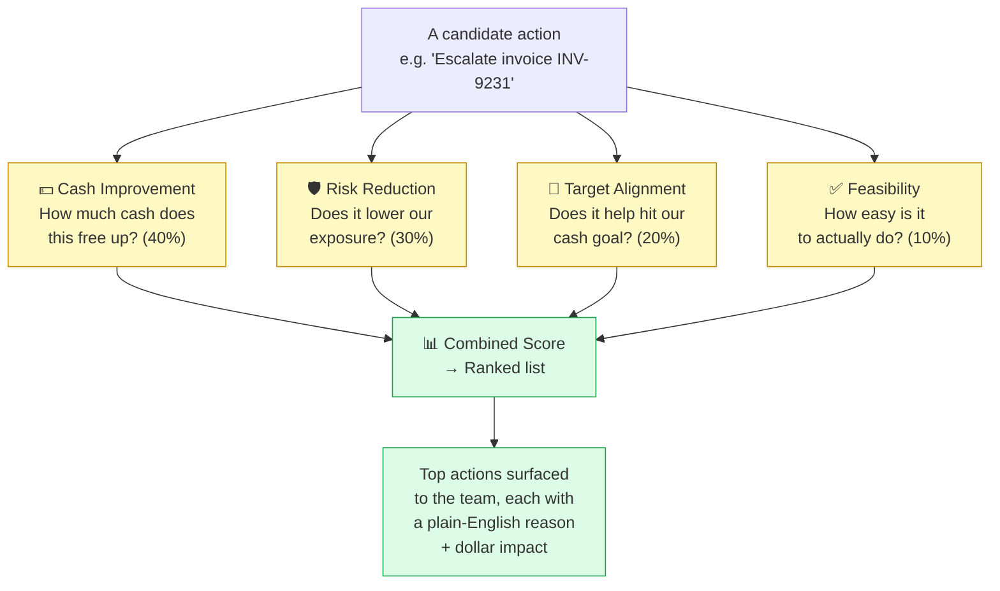
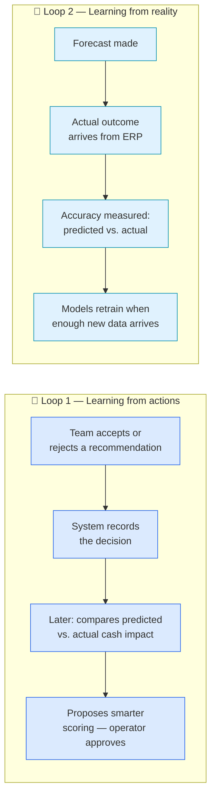
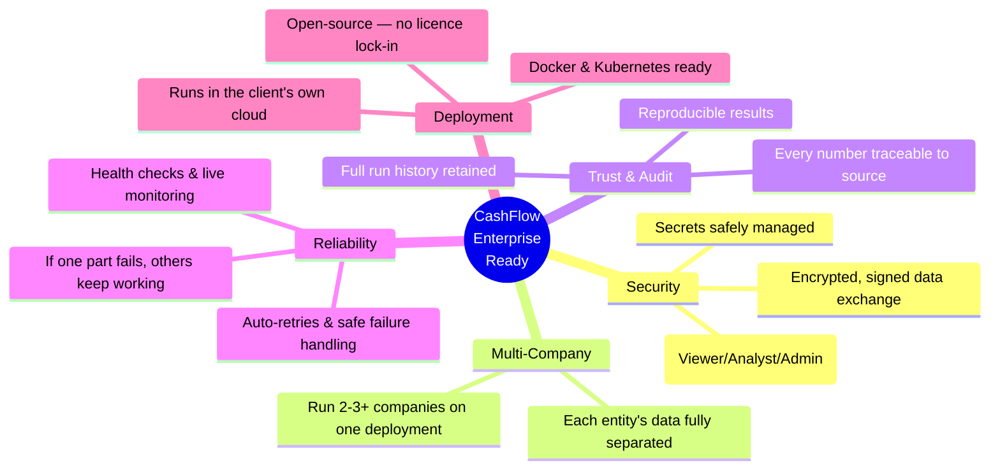

# CashFlow — Product Understanding Guide
### A plain-language guide for the Sales & Client-facing team

> **What it is in one sentence:** CashFlow is an AI-powered treasury platform that gives finance teams a single, trusted, always-up-to-date picture of the money coming in and going out — and tells them exactly what to do about it.

This document is written for **non-technical readers**. No code knowledge needed. Use it to understand the product, pitch it confidently, and answer client questions.

---

## Table of Contents

1. [The 30-Second Pitch](#1-the-30-second-pitch)
2. [The Problem We Solve](#2-the-problem-we-solve)
3. [What the Product Actually Does](#3-what-the-product-actually-does)
4. [The Big Picture (Diagram)](#4-the-big-picture-diagram)
5. [The 9 Building Blocks — In Plain English](#5-the-9-building-blocks--in-plain-english)
6. [The "Brain": One Shared Source of Truth (Diagram)](#6-the-brain-one-shared-source-of-truth-diagram)
7. [A Day in the Life (Customer Journey Diagram)](#7-a-day-in-the-life-customer-journey-diagram)
8. [The Recommendation Engine — Where the Magic Happens](#8-the-recommendation-engine--where-the-magic-happens)
9. [It Learns and Gets Smarter (Diagram)](#9-it-learns-and-gets-smarter-diagram)
10. [Why We Win — Key Differentiators](#10-why-we-win--key-differentiators)
11. [Enterprise-Ready Checklist](#11-enterprise-ready-checklist)
12. [Sales FAQ & Objection Handling](#12-sales-faq--objection-handling)
13. [Glossary](#13-glossary)

---

## 1. The 30-Second Pitch

Most finance teams forecast their cash in a tangle of spreadsheets — one tab for customer payments, another for vendor bills, others for projects, sales deals, loans, and expenses. **Nobody has the complete picture**, and the moment a customer pays late or a deal slips, every spreadsheet is already out of date.

**CashFlow fixes this.** It pulls all those pieces into **one unified, live cash forecast**, predicts *when* money will actually move (not just when it's "due"), and hands the treasury team a ranked list of **specific, explainable actions** to protect and improve their cash position — like "chase these 3 invoices" or "safely delay this vendor payment by a week."

It's **accurate** (machine learning where behaviour varies), **trustworthy** (every number traces back to its source), and **reactive** (updates within minutes when reality changes).

---

## 2. The Problem We Solve

**The four pains every treasury team feels:**

| Pain | What it costs them |
|------|--------------------|
| **No single view** — cash data lives in 9 different places | Decisions made blind; surprises at month-end |
| **"Due date" ≠ "pay date"** — customers rarely pay exactly on time | Forecasts are wrong from day one |
| **Forecasts go stale fast** — a manual model is outdated within days | Team loses trust in their own numbers |
| **No clear next step** — even with data, *"so what do I do?"* | Reactive firefighting instead of planning |

---

## 3. What the Product Actually Does

CashFlow does **four jobs**, in order:

1. **Predict** — Using AI, it learns each customer's and vendor's real payment habits to predict the *actual* date money will arrive or leave — not just the invoice due date.
2. **Forecast** — It projects cash from every source: invoices, bills, projects, sales deals, loans/grants, and expenses.
3. **Unify** — It merges all of that into **one** clean cash position (daily, weekly, monthly), removing duplicates and flagging how much to trust each number.
4. **Recommend** — It produces a **ranked list of actions** the team can take to improve cash — each one explained in plain terms with the dollar impact.

---

## 4. The Big Picture (Diagram)

Here's the whole product on one page. Don't worry about every box — the key message is: **data flows in from the company's systems → CashFlow's modules process it → the team gets a unified forecast and a to-do list.**

> **Sales takeaway:** The system has two "engines." **AI engines** (blue) handle the unpredictable stuff — when will this customer *really* pay? **Rule engines** (green) handle the predictable stuff — when is salary due, when does this project bill? Both feed into **one unified number** (yellow), which drives **recommended actions** (pink).

---

## 5. The 9 Building Blocks — In Plain English

The platform is made of 9 modules. Here's what each one does in business terms — and why a client cares.

| Module | Nickname | What it answers | Why the client cares |
|--------|----------|-----------------|----------------------|
| **S1** | Customer Payments (AR) | "When will each customer *actually* pay us?" | Stops them assuming customers pay on the due date — they almost never do |
| **S2** | Vendor Payments (AP) | "When should we pay each bill — and which can we safely delay?" | Optimises *when* cash leaves; captures early-payment discounts |
| **Credit Risk** | Risk Radar | "Which customers are LOW / MEDIUM / HIGH risk?" | Prioritises collections; avoids extending credit to bad payers |
| **S3** | Project Billing (WIP) | "When will our in-progress projects bill and collect?" | Forecasts cash from project milestones, not guesses |
| **S4** | Sales Pipeline | "How much cash will our open sales deals turn into, and when?" | Connects the CRM/sales pipeline to actual cash timing |
| **S5** | Contingent Inflows | "When will loans, grants, and refunds land?" | Captures big lumpy inflows often missed in spreadsheets |
| **S6** | Expenses | "When are salaries, taxes, renewals, and ad-hoc costs due?" | Complete outflow picture, including expenses that skip the normal PO process |
| **S7** | The Unifier | "What is our one true cash position?" | The single number everyone trusts — no more 9 conflicting tabs |
| **RE** | The Advisor | "What should we *do* about it today?" | Turns the forecast into ranked, explainable actions |

### The three "action levers" the Advisor can pull

Every recommendation comes with **guardrails**: never drop below a minimum cash floor, and never delay payments to your most important (Tier-1) vendors. The client stays in control.

---

## 6. The "Brain": One Shared Source of Truth (Diagram)

A key selling point: every module reads from the **same shared "memory"** of customer and vendor behaviour. This is called the **Feature Store** — think of it as the platform's brain. No module makes up its own numbers; they all draw from one consistent, versioned source.

> **Why this matters to a client:** Consistency and trust. When the sales team, the collections team, and the finance team all look at "Customer X," they see the *same* behaviour profile. And because every number is versioned and timestamped, the company can always answer **"why did the system say that?"** — critical for audits.

---

## 7. A Day in the Life (Customer Journey Diagram)

Here's a real scenario showing how the platform reacts the moment something changes — **within minutes, not at the next overnight batch.**

**The three signature journeys we can demo to a client:**

1. **"Reality changed" journey** — A customer pays (or a bill is disputed) → the forecast and recommendations refresh automatically within minutes.
2. **"Morning briefing" journey** — Overnight, the platform consolidates everything into a fresh cash position and a ranked action list, ready by 8 AM.
3. **"Closing the loop" journey** — A team member acts on a recommendation → the system later compares what it predicted vs. what actually happened → and uses that to get smarter.

---

## 8. The Recommendation Engine — Where the Magic Happens

This is the part clients get most excited about. It's not just a forecast — it's **advice**.

Every recommendation is scored on **four dimensions**, then ranked so the team sees the highest-impact actions first:

**Every recommendation answers four questions:**
- **What** — the specific action ("escalate this invoice")
- **Why** — the reasoning ("customer is 18 days overdue, MEDIUM risk")
- **Who/Which** — the exact entity (invoice, customer, or vendor)
- **How much** — the cash impact in dollars

> **Sales takeaway:** This is the difference between a *report* (here's your data, good luck) and an *advisor* (here's exactly what to do and why). It's explainable — never a black box — which is exactly what finance leaders need to trust and act on it.

---

## 9. It Learns and Gets Smarter (Diagram)

CashFlow isn't a static tool — it improves the more it's used. Two feedback loops drive this.

**The accuracy scorecard:** The client grades the system on a single, agreed metric — a blend that weights **getting the cash amount right (70%)** more heavily than **getting the exact day right (30%)**. This is tracked continuously and shown on the monitoring dashboard.

> **Important reassurance for clients:** The system never changes its own scoring automatically in the early days. It *proposes* improvements; a human approves them. This prevents erratic behaviour while trust is being built.

---

## 10. Why We Win — Key Differentiators

These are your headline talking points:

| # | Differentiator | The one-liner |
|---|----------------|---------------|
| 1 | **One unified position** | "Replace 9 spreadsheets with one trusted number." |
| 2 | **Predicts real behaviour** | "We forecast when customers *actually* pay — not the fantasy due date." |
| 3 | **Works on day one (thin data)** | "Even with few records or brand-new customers, smart fallbacks give a sensible answer — no cold-start problem." |
| 4 | **Actionable, not just analytical** | "It tells you what to do, why, and the dollar impact — ranked." |
| 5 | **Fully explainable** | "Every number traces back to its source. No black boxes. Audit-ready." |
| 6 | **Reacts in minutes** | "When reality changes, the forecast changes — not tomorrow, now." |
| 7 | **Self-improving** | "It learns from your decisions and from what actually happens." |
| 8 | **Enterprise-grade** | "Multi-company, secure, monitored, and cloud-ready out of the box." |
| 9 | **Open-source foundation** | "No expensive vendor lock-in — built on open technology, self-hosted." |

### The "core unlock" worth explaining

One thing that genuinely sets us apart: **how we handle thin or brand-new data.** Many AI products fail when a customer has only a handful of invoices, or is brand new. CashFlow uses a clever **"borrow from similar"** technique — if it doesn't know much about *this* customer yet, it blends in what it knows about *similar* customers and the *overall* portfolio, then leans more on the customer's own history as it accumulates. This means **useful predictions from day one**, getting sharper over time. (Technically: a "hierarchical prior" — but you can just call it *smart fallbacks*.)

---

## 11. Enterprise-Ready Checklist

When a client's IT or finance leadership asks "is this production-ready?", here's your yes-list:

| Capability | What to tell the client |
|------------|-------------------------|
| **Multi-company** | "Run several legal entities on one system — their data never mixes." |
| **Security** | "Signed, verified data exchange; role-based permissions; managed secrets." |
| **Auditability** | "Every forecast can be traced back to the exact data and logic that produced it." |
| **Reliability** | "If one module hiccups, the rest keep running on good data — no cascade failures." |
| **Monitoring** | "Live health checks and accuracy dashboards — you always know it's working." |
| **Cloud-ready** | "Deploys to your own cloud with standard, open tools. No proprietary lock-in." |
| **Integrates cleanly** | "It plugs into your existing Data Hub — we don't touch your ERP directly, reducing risk." |

---

## 12. Sales FAQ & Objection Handling

**Q: "We already have a forecast in Excel. Why change?"**
A: Excel is a snapshot — it's outdated the moment a customer pays late. CashFlow is *live*: it updates within minutes, unifies all 9 cash sources automatically, and tells you what to *do*, not just what *is*.

**Q: "Does it just guess? How do we trust an AI for our cash?"**
A: It's deliberately *deterministic first* — the predictable cash (salaries, project milestones, scheduled inflows) uses transparent business rules. AI only *adjusts* the uncertain parts (when customers/vendors actually pay). And **everything is explainable and traceable** — never a black box.

**Q: "We don't have much historical data yet."**
A: That's exactly where we shine. Our "smart fallbacks" borrow from similar customers and your overall portfolio, so you get useful forecasts from day one — and they sharpen as data accumulates.

**Q: "Will it work for our multiple business entities?"**
A: Yes — multi-company is built in. Each entity's data is fully isolated, all on one deployment.

**Q: "What if it makes a bad recommendation?"**
A: Recommendations have guardrails (minimum cash floor, protected key vendors), they're ranked and explained so the team reviews them, and the system *learns* from accepted/rejected feedback — with a human approving any change to how it scores.

**Q: "How does it connect to our systems?"**
A: It consumes data from your existing **Data Hub** (a clean integration layer) and publishes results back to it. We never connect directly to your ERP/CRM — that's lower-risk and easier for your IT team to approve.

**Q: "Is this locked to a vendor?"**
A: No. It's built entirely on **open-source** technology and runs in **your own cloud**. No per-seat licence traps.

**Q: "How accurate is it?"**
A: Accuracy is tracked continuously against a single agreed scorecard (weighted 70% toward getting the cash *amount* right, 30% toward the exact *day*). It's visible on a live dashboard, and the system retrains as new data arrives.

---

## 13. Glossary

Quick translations from technical terms to plain language — handy when a client's technical staff joins the call.

| You might hear / read | It really means |
|-----------------------|-----------------|
| **AR / Accounts Receivable** | Money customers owe us (money coming in) |
| **AP / Accounts Payable** | Money we owe vendors (money going out) |
| **S1–S7** | The numbered forecasting modules (see Section 5) |
| **WIP** | Work-in-progress — projects being delivered but not yet fully billed |
| **Pipeline** | Open sales deals that haven't closed yet |
| **Contingent inflows** | Lumpy, less-frequent money in: loans, grants, refunds |
| **Non-PO expense** | A cost with no purchase order (legal fees, ad-hoc travel, ad spend) |
| **Feature Store** | The shared "brain" — one consistent profile of every customer & vendor |
| **Recommendation Engine** | The advisor that ranks what actions to take |
| **Cold-start / thin data** | Little or no history yet — handled by our "smart fallbacks" |
| **Hierarchical prior** | The "borrow from similar customers" technique for thin data |
| **Reconciliation** | Comparing what we predicted vs. what actually happened |
| **Multi-tenant** | One system safely serving multiple companies/entities |
| **Data Hub** | The client's integration layer we read from and write to |
| **Deterministic** | Rule-based and predictable (vs. AI-learned) |
| **Audit / lineage** | The paper trail proving where every number came from |

---

### One-line summary to leave them with

> **"CashFlow turns nine messy spreadsheets into one trusted, live cash forecast — and tells your treasury team exactly what to do to protect and grow their cash, with the reasoning shown every step of the way."**

---

*This guide is a companion to the technical documentation (README, README_APPROACH, README_FLOWS). For deeper detail on any module, see the matching `README.md` inside each `steps/` folder.*
