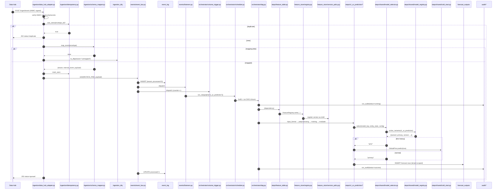
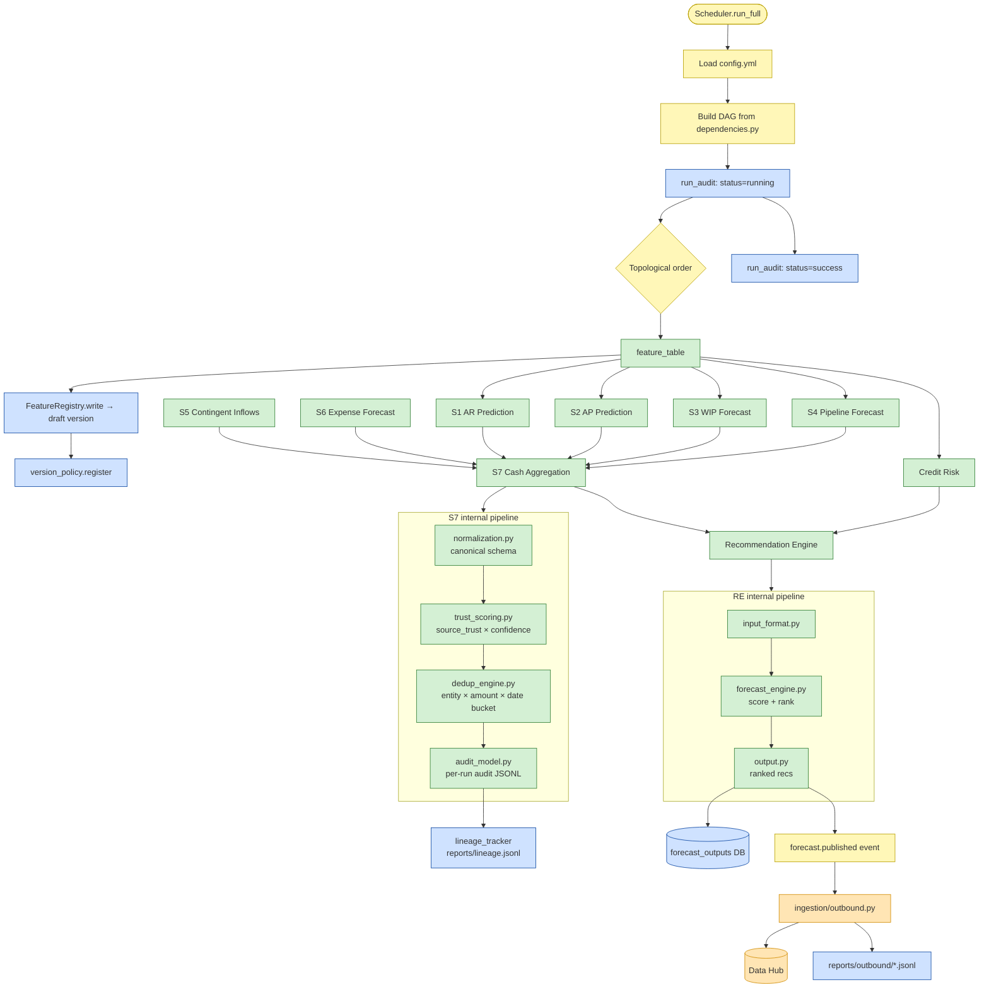
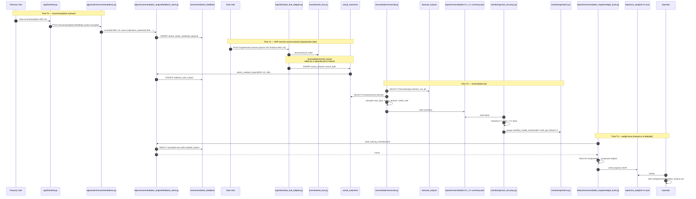

# Cash Flow Forecasting Platform — File Interconnection & Flow Reference

A developer-oriented walk through the codebase. Every diagram uses **Mermaid** (renders natively on GitHub + most IDE markdown previewers). Three end-to-end scenarios from the SDD show exactly which files fire, in what order, and what they read/write.

Companion documents:
- [README_APPROACH.md](README_APPROACH.md) — why the architecture looks this way
- [README_v2.md](README_v2.md) — usage + API reference

---

## Table of Contents

1. [How to read the diagrams](#1-how-to-read-the-diagrams)
2. [Top-level system topology](#2-top-level-system-topology)
3. [Scenario 1: Invoice Paid → AR Prediction Re-score](#3-scenario-1-invoice-paid--ar-prediction-re-score)
4. [Scenario 2: Daily Batch Forecast → Recommendations](#4-scenario-2-daily-batch-forecast--recommendations)
5. [Scenario 3: Recommendation Acted On → Reconciliation → Weight Tune](#5-scenario-3-recommendation-acted-on--reconciliation--weight-tune)
6. [Event → Listener → Target quick reference](#6-event--listener--target-quick-reference)
7. [File → Purpose quick reference](#7-file--purpose-quick-reference)

---

## 1. How to read the diagrams

- **Rectangles** are modules or DB tables. **Rounded rectangles** are external systems.
- **Arrows** are function calls or data flow; labels name the function or the column.
- **Subgraphs** group files by architectural layer (from [README_APPROACH.md §3](README_APPROACH.md)).
- Colour coding when used:
  - 🟦 Infrastructure (db / security / audit / monitoring)
  - 🟨 Orchestration (events / DAG / scheduler)
  - 🟩 Domain logic (steps / reconciliation)
  - 🟧 Integration (ingestion)
  - 🟪 Presentation (app / routers / pages)

If a diagram doesn't render in your viewer, install a Mermaid plugin or open the file on GitHub.

---

## 2. Top-level system topology

```mermaid
flowchart TB
  subgraph EXT["External"]
    DH[(Data Hub)]
    USER((Treasury User))
  end

  subgraph PRES["5 · Presentation"]
    API[app/api.py]
    FRONT[app/frontend.py]
    NONPO[app/routers/non_po_expenses.py]
    RECROUTE[app/routers/recommendations.py]
    HEALTH[monitoring/health.py]
  end

  subgraph INT["2 · Integration"]
    ADAPT[ingestion/data_hub_adapter.py]
    MAPPER[ingestion/schema_mapper.py]
    IDEM[ingestion/idempotency.py]
    OUTB[ingestion/outbound.py]
  end

  subgraph ORCH["3 · Orchestration"]
    BUS[events/event_bus.py]
    LIST[events/listeners.py]
    VOLT[orchestrator/volume_trigger.py]
    SCHED[orchestrator/scheduler.py]
    DAG[orchestrator/dag.py]
    DEPS[orchestrator/dependencies.py]
  end

  subgraph DOM["4 · Domain"]
    FEAT[steps/feature_table.py]
    S1[steps/s1_ar_prediction/*]
    S2[steps/s2_ap_prediction/*]
    CR[steps/credit_risk/*]
    S3[steps/s3_wip_forecast/*]
    S4[steps/s4_pipeline_forecast/*]
    S5[steps/s5_contingent_inflows/*]
    S6[steps/s6_expense_forecast/*]
    S7[steps/s7_cash_aggregation/*]
    RE[steps/recommendation_engine/*]
    SHARED[steps/shared/*]
    RECON[reconciliation/reconcile.py]
    KPI[monitoring/cash_accuracy.py]
  end

  subgraph INFRA["1 · Infrastructure"]
    DB[(SQLite / Postgres)]
    FSTORE[feature_store/*]
    AUDIT[audit/*]
    METRICS[monitoring/metrics.py]
    SEC[security/*]
  end

  DH -- webhook --> ADAPT
  ADAPT --> IDEM
  ADAPT --> MAPPER
  ADAPT -- emit --> BUS

  USER -- HTTPS --> API
  API --> NONPO
  API --> RECROUTE
  API --> HEALTH

  BUS --> LIST
  BUS --> VOLT
  LIST --> SCHED
  VOLT --> SCHED
  SCHED --> DAG
  DAG --> DEPS
  DAG --> FEAT
  DAG --> S1 & S2 & CR & S3 & S4 & S5 & S6 & S7 & RE

  S1 & S2 & CR --> SHARED
  S1 & S2 & CR & S3 & S4 & S5 & S6 --> S7
  S7 --> RE
  RE --> OUTB
  OUTB -- HMAC POST --> DH

  FEAT --> FSTORE
  S1 & S2 & CR & S3 & S4 & S5 & S6 & S7 & RE --> DB
  DAG --> AUDIT
  BUS --> DB

  RECON --> DB
  KPI --> RECON
  HEALTH --> METRICS

  classDef ext     fill:#eee,stroke:#666,stroke-dasharray:4 3;
  classDef pres    fill:#eaddff,stroke:#6a3d9a;
  classDef int     fill:#ffe5b4,stroke:#d08b00;
  classDef orch    fill:#fff7b8,stroke:#b89f00;
  classDef dom     fill:#d4f0d4,stroke:#2e7d32;
  classDef infra   fill:#cfe2ff,stroke:#0d47a1;
  class DH,USER ext;
  class API,FRONT,NONPO,RECROUTE,HEALTH pres;
  class ADAPT,MAPPER,IDEM,OUTB int;
  class BUS,LIST,VOLT,SCHED,DAG,DEPS orch;
  class FEAT,S1,S2,CR,S3,S4,S5,S6,S7,RE,SHARED,RECON,KPI dom;
  class DB,FSTORE,AUDIT,METRICS,SEC infra;
```



---

## 3. Scenario 1: Invoice Paid → AR Prediction Re-score

**SDD reference:** S1 must update its AR payment prediction within minutes of a payment event — not at the next batch.

**Trigger:** Data Hub pushes `{"type": "invoice.paid", "tenant_id": "entity_alpha", "data": {"invoice_id": "INV-9231", ...}}`.

### 3.1 Sequence



### 3.2 Files touched, in order

| Step | File | What it does |
|------|------|--------------|
| 1 | [ingestion/data_hub_adapter.py](ingestion/data_hub_adapter.py) | Receives webhook, verifies HMAC |
| 2 | [security/secrets.py](security/secrets.py) | Resolves `DATA_HUB_SIGNING_KEY` |
| 3 | [ingestion/idempotency.py](ingestion/idempotency.py) | `was_seen` / `mark_seen` against `ingestion_seen` |
| 4 | [ingestion/schema_mapper.py](ingestion/schema_mapper.py) | Envelope → internal event name + payload |
| 5 | [events/event_bus.py](events/event_bus.py) | Persist to `event_log`, dispatch to listeners |
| 6 | [events/listeners.py](events/listeners.py) | Routes `invoice.paid` → S1 subgraph |
| 7 | [orchestrator/volume_trigger.py](orchestrator/volume_trigger.py) | Increments counter; fires full retrain when threshold hit |
| 8 | [orchestrator/scheduler.py](orchestrator/scheduler.py) | Builds DAG closure: `{feature_table, s1_ar_prediction}` |
| 9 | [orchestrator/dag.py](orchestrator/dag.py) | Topological run + audit row |
| 10 | [steps/feature_table.py](steps/feature_table.py) | Rebuilds customer + invoice features |
| 11 | [feature_store/registry.py](feature_store/registry.py) | Persists features (draft version) |
| 12 | [feature_store/version_policy.py](feature_store/version_policy.py) | `register(...)` draft row in `feature_versions` |
| 13 | [steps/s1_ar_prediction/*](steps/s1_ar_prediction/) | Full 4-stage ML pipeline |
| 14 | [steps/shared/model_selector.py](steps/shared/model_selector.py) | Picks primary / baseline / prior |
| 15 | [steps/shared/model_registry.py](steps/shared/model_registry.py) | Reads active variant for tenant |
| 16 | [steps/shared/cold_start.py](steps/shared/cold_start.py) | Fallback prediction for thin entities |
| 17 | `forecast_outputs` | Row with `reference_id=INV-9231`, `tenant_id="entity_alpha"` |
| 18 | [audit/audit_logger.py](audit/audit_logger.py) + `run_audit` | `status=success` |

### 3.3 Failure handling

- **Malformed envelope** → `ingestion_dlq` row with `reason="malformed"`. Replay via `POST /ingest/dlq/replay`.
- **Unknown event type** → `ingestion_dlq` with `reason="unmapped"`.
- **Handler raises** → `event_log.processed=0`. Recover with `bus.replay_pending()`.
- **S1 task fails** → DAG marks S1 `failed` and any downstream task `skipped`; `run_audit.status="failed"`, `error=<task list>`.

---

## 4. Scenario 2: Daily Batch Forecast → Recommendations

**SDD reference:** Treasury needs a consolidated end-of-day cash position plus a ranked list of actions by 08:00 next morning.

**Trigger:** `python -m orchestrator.scheduler` (manual) or a cron job hitting the same entry point. Or `forecast.published` triggered by the batch completion.

### 4.1 Flowchart



### 4.2 Why the DAG shape is this way

Edges come from [orchestrator/dependencies.py](orchestrator/dependencies.py):

- `feature_table` → every ML module (S1, S2, Credit Risk) + S3, S4
- S5, S6 have **no dependencies** (deterministic, self-contained) → they run in parallel with everything else
- S7 waits on all S1–S6
- RE waits on S7 + Credit Risk

If any ML task fails, S7 still attempts — S7's dedup engine is designed to tolerate missing sources. If S7 fails, RE is marked `skipped` (no point ranking against a missing position).

### 4.3 Where data lands

| Stage | Output | Location |
|-------|--------|----------|
| feature_table | 6 versioned feature sets | `feature_snapshots` (DB) + `Data/features/*.csv` (legacy) |
| S1/S2/CR | Trained model pickles + predictions | `models/<module>/*.pkl`, `forecast_outputs` (DB) |
| S3/S4/S5/S6 | Rule-based forecasts | `forecast_outputs` (DB) + `Data/forecast_outputs/*.csv` |
| S7 | Canonical cash position | `forecast_outputs` with `source_model="s7"`, plus `reports/s7_audit.jsonl` |
| RE | Ranked recommendations | `forecast_outputs` with `source_model="recommendation_engine"` |
| Every task | Audit edge | `run_audit` (DB) + `reports/lineage.jsonl` |

### 4.4 Observability during the run

- Each task start/end emits structured log lines (JSON in prod via `CASHFLOW_LOG_FORMAT=json`).
- `monitoring/metrics.py` exposes `cashflow_runs_total{pipeline="full", status}` and `cashflow_run_duration_seconds{pipeline="full"}` for scraping.
- `monitoring/health.py` `/health/ready` returns 503 if the DB probe fails.

---

## 5. Scenario 3: Recommendation Acted On → Reconciliation → Weight Tune

**SDD reference:** The recommendation engine must learn from user actions. Accept / reject signals + realised cash impact feed a weight tuner that proposes revised scoring weights.

**Trigger:** A user accepts a recommendation in the UI; later, the ERP records the realised outcome.

### 5.1 Sequence across time



### 5.2 The three persistent tables in this loop

| Table | Role in the loop | Populated by |
|-------|------------------|--------------|
| `recommendation_feedback` | User action + (later) realised cash | `feedback_store.record` at accept time, `feedback_store.attach_realised_impact` at reconciliation time |
| `forecast_outputs` | What the system predicted | Every model's output stage |
| `actual_outcomes` | What actually happened | `reconciliation.record_actual` from Data Hub push or manual entry |

### 5.3 Why the tuner is advisory only

Q11 asked us to build the weights from scratch. The tuner runs a non-negative least-squares fit of `realised ≈ Σ w_k · component_k`. Before promoting a proposal:

1. Operator sees `sample_size` in the JSON — if < 20, `status="skipped"` already.
2. Operator sees `current_weights` vs `proposed_weights` side by side.
3. Operator edits `config/recommendation_engine.yml` manually.

This deliberately avoids oscillation during the early-feedback phase. Once volume stabilises (a few hundred accepted recs with realised impact), a scheduled promotion behind a feature flag is a ~20-line change.

### 5.4 How cash-accuracy KPI is computed

```
cash_accuracy = (1 − clamp(mape_amount, 0, 1)) · 100
days_accuracy = max(0, 1 − mae_days / mae_days_target) · 100
kpi           = cash_weight · cash_accuracy + days_weight · days_accuracy
```

- Defaults from [config.yml](config.yml): `cash_weight=0.7`, `days_weight=0.3`, `mae_days_target=10`.
- Regression gate in [tests/regression/baselines.yml](tests/regression/baselines.yml) fails CI if `kpi` drops > 5 points below baseline.
- Exposed to Prometheus under `cashflow_model_mae{model="cash_kpi:<tenant>"}`.

---

## 6. Event → Listener → Target quick reference

| Event | Listener location | Effect |
|-------|-------------------|--------|
| `invoice.created` / `invoice.updated` / `invoice.paid` | `events/listeners.py::_rescore_s1` | `Scheduler.run_subgraph(["s1_ar_prediction"])` |
| `bill.created` / `bill.updated` / `bill.paid` | `events/listeners.py::_rescore_s2` | `Scheduler.run_subgraph(["s2_ap_prediction"])` |
| `customer.updated` / `vendor.updated` | `events/listeners.py::_rescore_both` | `Scheduler.run_subgraph(["feature_table"])` → cascades to all consumers |
| any of the above (volume) | `orchestrator/volume_trigger.py` | Counts events per `(tenant, model)`; fires full subgraph at threshold |
| `forecast.published` | `ingestion/outbound.py::_on_forecast_published` | POST to Data Hub, JSONL fallback |
| `feature_store.refreshed` | *(hook reserved for future)* | — |

Add a new event in three steps:
1. Add the string constant to [events/triggers.py](events/triggers.py).
2. Add a listener in [events/listeners.py](events/listeners.py) and register it.
3. Emit via `bus.emit(EventName.NEW_EVENT, payload)`.

---

## 7. File → Purpose quick reference

### Entry points / runners
| File | When to touch it |
|------|------------------|
| [main.py](main.py) | Legacy linear runner (v1). Keep for regression parity only. |
| [orchestrator/scheduler.py](orchestrator/scheduler.py) | Production entry for a full run (`python -m orchestrator.scheduler`). |
| [pipeline/run_*.py](pipeline/) | Single-module CLI runners. |
| [app/api.py](app/api.py) | FastAPI application factory. Mount new routers here. |
| [app/frontend.py](app/frontend.py) | Main Streamlit dashboard. |

### Data layer
| File | Purpose |
|------|---------|
| [db/models.py](db/models.py) | All SQLAlchemy ORM tables. Add new columns here. |
| [db/connection.py](db/connection.py) | Engine + session factory. |
| [db/migrations/001_initial_schema.py](db/migrations/001_initial_schema.py) | Creates v2 core tables. |
| [db/migrations/002_tenant_and_new_tables.py](db/migrations/002_tenant_and_new_tables.py) | Adds `tenant_id` + non-PO/actuals. |
| [db/migrations/003_partials_improvements.py](db/migrations/003_partials_improvements.py) | Adds feature_versions / model_registry / DLQ / idempotency / rec_feedback. |
| [feature_store/registry.py](feature_store/registry.py) | Read/write interface for versioned features. |
| [feature_store/version_policy.py](feature_store/version_policy.py) | draft / active / frozen / retired state machine. |

### Orchestration + events
| File | Purpose |
|------|---------|
| [orchestrator/dag.py](orchestrator/dag.py) | DAG executor. |
| [orchestrator/scheduler.py](orchestrator/scheduler.py) | Builds the full + partial DAGs. |
| [orchestrator/dependencies.py](orchestrator/dependencies.py) | Declarative edge list. Edit to change dependency shape. |
| [orchestrator/volume_trigger.py](orchestrator/volume_trigger.py) | Event-counter-based retrain trigger. |
| [events/event_bus.py](events/event_bus.py) | Pub/sub with DB persistence. |
| [events/listeners.py](events/listeners.py) | Default event-to-subgraph mappings. |
| [events/triggers.py](events/triggers.py) | Event name catalogue. |

### Integration
| File | Purpose |
|------|---------|
| [ingestion/data_hub_adapter.py](ingestion/data_hub_adapter.py) | Inbound webhook + bulk + DLQ replay. |
| [ingestion/schema_mapper.py](ingestion/schema_mapper.py) | Data Hub envelope → internal event. |
| [ingestion/idempotency.py](ingestion/idempotency.py) | `envelope_id` dedup + DLQ writers. |
| [ingestion/outbound.py](ingestion/outbound.py) | Publish `forecast.published` back to Data Hub. |

### Domain
| File | Purpose |
|------|---------|
| [steps/feature_table.py](steps/feature_table.py) | Builds all 6 feature tables. |
| [steps/s1_ar_prediction/](steps/s1_ar_prediction/) | AR prediction ML pipeline. |
| [steps/s2_ap_prediction/](steps/s2_ap_prediction/) | AP prediction + liquidity_gate + treasury_logic. |
| [steps/credit_risk/](steps/credit_risk/) | Risk classifier. |
| [steps/s3_wip_forecast/](steps/s3_wip_forecast/) ... [steps/s6_expense_forecast/](steps/s6_expense_forecast/) | Rule-based modules. |
| [steps/s7_cash_aggregation/](steps/s7_cash_aggregation/) | normalise → trust → dedup → audit. |
| [steps/recommendation_engine/](steps/recommendation_engine/) | Scoring + feedback_store + weight_tuner. |
| [steps/shared/cold_start.py](steps/shared/cold_start.py) | Hierarchical prior. |
| [steps/shared/model_selector.py](steps/shared/model_selector.py) | Per-call primary/baseline/prior choice. |
| [steps/shared/model_registry.py](steps/shared/model_registry.py) | Promotion state machine. |
| [steps/shared/thin_data.py](steps/shared/thin_data.py) | Shared thin-vs-rich metric analyser. |
| [reconciliation/reconcile.py](reconciliation/reconcile.py) | Forecast ⋈ Actual variance + summary. |

### Cross-cutting
| File | Purpose |
|------|---------|
| [security/tenant_context.py](security/tenant_context.py) | Request-scoped tenant context-var. |
| [security/auth.py](security/auth.py) | HMAC bearer tokens. |
| [security/rbac.py](security/rbac.py) | `Role` enum + FastAPI dep. |
| [security/secrets.py](security/secrets.py) | env / .env / /run/secrets resolver. |
| [audit/audit_logger.py](audit/audit_logger.py) | JSONL audit trail. |
| [audit/lineage_tracker.py](audit/lineage_tracker.py) | Dataset lineage graph. |
| [monitoring/metrics.py](monitoring/metrics.py) | Prometheus counters/gauges. |
| [monitoring/health.py](monitoring/health.py) | `/health/live`, `/health/ready`, `/metrics`. |
| [monitoring/cash_accuracy.py](monitoring/cash_accuracy.py) | Composite KPI from reconciliation summary. |
| [monitoring/logging_config.py](monitoring/logging_config.py) | JSON / text log formatter. |
| [core/retry.py](core/retry.py) | Exponential-backoff decorator. |
| [core/circuit_breaker.py](core/circuit_breaker.py) | State-machine breaker for unhealthy deps. |
| [core/exceptions.py](core/exceptions.py) | Domain exception hierarchy. |

---

## 8. When in doubt

- **"Where does data X land?"** → grep for the column name under [db/models.py](db/models.py). Every persisted field has exactly one table.
- **"What fires when Y happens?"** → §6 table or grep the event name in [events/listeners.py](events/listeners.py).
- **"Which files does scenario Z touch?"** → §3 / §4 / §5.
- **"Why is it built this way?"** → [README_APPROACH.md](README_APPROACH.md).
- **"How do I run it?"** → [README_v2.md §5](README_v2.md#5-run-flow--step-by-step).
